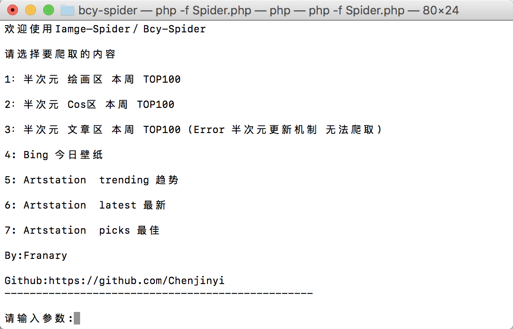

# Image-spider

bcy-spider

Artstation-spider

BiliBIli-Spider

新版/另外一个 爬虫链接 [**PHP-Images-Spider**](https://github.com/Chenjinyi/PHP-Images-Spider)

https://github.com/Chenjinyi/PHP-Images-Spider 一个更强大的爬虫

## 简介

#### ~~Bcy爬虫~~ 自动爬取半次元COS Bing Artstation Bilibili .....等图片网站 ,采用PHP编写

BcySpider2.0开发中

## 公告

2018.5.26：半次元改为需要登陆后才能爬取现暂不能爬取

其他网站bing bilibili artstation依然可以使用

## 使用方法

**Terminal/CMD 终端使用**

**Spider.php:**  爬取各种图片网站

```php
php -f Spider.php
```

交互式界面 提示使用



#### 功能列表


```


1：半次元 绘画区 本周 TOP100

2：半次元 Cos区 本周 TOP100

3：半次元 文章区 本周 TOP100 (Error 半次元更新机制 无法爬取)

4: Bing 今日壁纸

5: Artstation  trending 趋势

6: Artstation  latest 最新

7: Artstation  picks 最佳

8: Artstation User 用户图片

9:BiliBili相簿 画友 周榜

10:BiliBIli相簿 画友 月榜

11:BIliBIli相簿 画友 日榜

12:BIliBIli相簿 COS 周榜

13:BIliBIli相簿 COS 月榜

14:BIliBIli相簿 COS 日榜

15:BIliBIli相簿 私服 周榜

16:BIliBIli相簿 私服 月榜

17:BIliBIli相簿 私服 日榜

By:Franary

Github:https://github.com/Chenjinyi
```


#### 已知bug

某些图片爬取时返回error	

概率较低

原因可能是

​	1.爬取速度太快服务器不予访问

​	2.某些链接不允许下载


#### 版本更新

0.1 Bcy绘画区热门爬取完成

0.2 BcyCOS区热门爬取完成

0.3 Debug

0.4 Bcy个人图片爬虫和      Bcy文章爬虫完成（已不可使用）

0.5 优化爬虫

0.6 优化爬虫，添加Bing每日爬虫

0.7 优化爬虫

0.8 版本大更新-交互式命令行爬虫

0.9 新增加Artstation爬虫 （测试版）

1.0 新增加Artstation 用户爬虫

1.1 新增加BiliBIli 相簿 绘画 COS 私服 日榜 周榜 月榜


#### Web文件夹

该目录为自动爬取并写入Mysql的爬虫实例

以及遍历成网站 


#### 更多爬虫

[Bcy-Spider 半次元爬虫](https://github.com/Chenjinyi/bcy-spider)

[TaoBao-Spider 淘宝爬虫](https://github.com/Chenjinyi/solid-computing-machine/tree/master/taobao-spider)

[Huaban-Spider 花瓣爬虫](https://github.com/Chenjinyi/solid-computing-machine/tree/master/huaban-spider)
