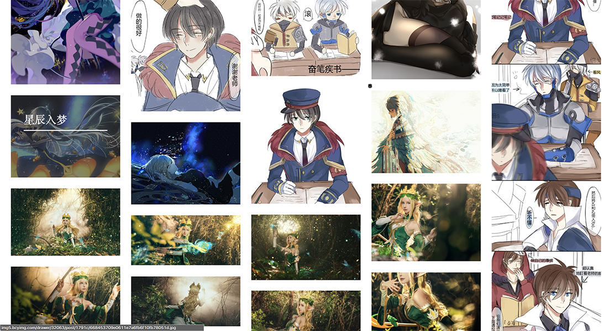

# Image-spider

bcy-spider

Artstation-spider

## 简介

#### Bcy爬虫 自动爬取半次元COS Bing Artstation .....等图片网站 ,采用PHP编写

## 使用方法

**Terminal/CMD 终端使用**

**Spider.php:**  爬取各种图片网站

```php
php -f Spider.php
```

交互式界面 提示使用


#### 功能列表


```


1：半次元 绘画区 本周 TOP100

2：半次元 Cos区 本周 TOP100

3：半次元 文章区 本周 TOP100 (Error 半次元更新机制 无法爬取)

4: Bing 今日壁纸

5: Artstation  trending 趋势

6: Artstation  latest 最新

7: Artstation  picks 最佳

8: Artstation User 用户图片


By:Franary

Github:https://github.com/Chenjinyi
```


#### 已知bug

某些图片爬取时返回504 error	

概率较低

原因可能是

​	1.爬取速度太快服务器不予访问

​	2.某些链接不允许下载

#### 新版本预告

BcySpider2 采用面向对象方式重写


#### 版本更新

0.1 绘画区热门爬取完成

0.2 COS区热门爬取完成

0.3 Debug

0.4 个人图片爬虫和文章爬虫完成（已不可使用）

0.5 优化爬虫

0.6 优化爬虫，添加Bing每日爬虫

0.7 优化爬虫

0.8 版本大更新-交互式命令行爬虫

0.9 新增加Artstation爬虫 （0.1测试版）

1.0 新增加Artstation 用户爬虫


#### Web文件夹

该目录为自动爬取并写入Mysql的爬虫实例

以及遍历成网站 




#### 更多爬虫

[Bcy-Spider 半次元爬虫](https://github.com/Chenjinyi/bcy-spider)

[TaoBao-Spider 淘宝爬虫](https://github.com/Chenjinyi/solid-computing-machine/tree/master/taobao-spider)

[Huaban-Spider 花瓣爬虫](https://github.com/Chenjinyi/solid-computing-machine/tree/master/huaban-spider)
